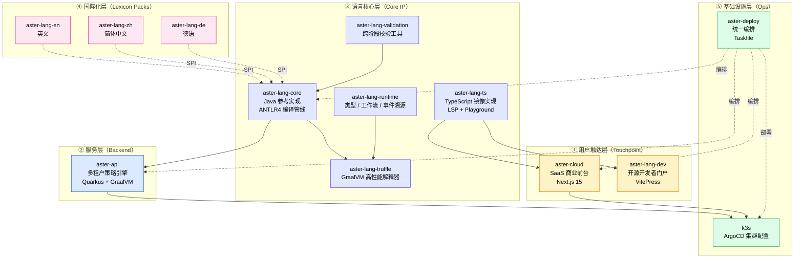

# Aster Lang — One Pager

> 一份对内对外都能讲清楚 "Aster 是什么" 的产品总览。
> 受众：投资人、潜在客户、新员工、合作伙伴。

---

## 一句话定位

**Aster Lang 是面向"业务规则可治理"的多语种受控自然语言（CNL）平台**——把传统埋在代码里的策略、合规、审批规则，提取成业务专家可读、IT 可审计、机器可执行的 **Policy-as-Code**。

---

## 六行价值主张

1. **业务专家用母语写规则**：英文 / 中文 / 德语开箱即用，再加一种语言只需配置一个 lexicon 包，不需要改编译器。
2. **规则可执行、可审计、可重放**：每次评估生成 SHA-256 哈希链审计记录，运行时基于确定性时钟 / UUID，可完整重放历史决策。
3. **AI 写草稿，人审上线**：内置 LLM 辅助（生成、解释、修复），把 CNL 学习曲线从"两周培训"压缩到"一次上手"。
4. **一份语义、双引擎实现**：Java（GraalVM Truffle）跑生产高吞吐，TypeScript 跑前端实时校验和 LSP，前后端永远不会出现"语义漂移"。
5. **既能 SaaS，也能自托管**：aster-cloud 提供托管 SaaS，K3S + ArgoCD 提供完整私有化部署，金融、医疗、政府客户的数据主权问题一并解决。
6. **Lexicon 是社区可扩展的生态**：lexicon SPI 已生产可用，第三方贡献者可通过 `aster-lang-template` 在数小时内贡献新语种到 Maven Central / npm；详见 [PM 08 lexicon contribution model](08-lexicon-contribution-model.md)。

---

## 三个 Persona × 三个入口

```
┌──────────────────────────────────────────────────────────────────────┐
│                                                                      │
│   👤 业务专家（合规官 / 风控 / 政策制定）                              │
│       ↓ 入口：aster-cloud SaaS（aster-lang.cloud）                    │
│       ↓ 价值：用中文/英文写规则；AI 帮你写草稿；版本化、协作、审计     │
│                                                                      │
│   👤 工程师（平台 / 后端 / DevOps）                                    │
│       ↓ 入口：aster-lang.dev 文档与 Playground                        │
│       ↓ 价值：REST/GraphQL/WS API；LSP 编辑器接入；自托管开源运行时    │
│                                                                      │
│   👤 IT 决策者（CTO / CISO / 合规负责人）                              │
│       ↓ 入口：aster-deploy + k3s 私有化部署                           │
│       ↓ 价值：数据不出域；GDPR / PII 内建；ArgoCD GitOps 可控          │
│                                                                      │
└──────────────────────────────────────────────────────────────────────┘
```

---

## 产品全景图（13 仓库 × 5 层架构）



---

## 用户旅程：从 Playground 到 Enterprise

```
   📖 发现             🎮 试用              💼 团队               🏢 企业
   aster-lang.dev  →  Playground 写  →  aster-cloud 团队  →  K3S 私有化
   读文档/案例         一条规则           协作 + 计费          + SSO + 审计
   (免费)              (匿名 / 5 分钟)    (Stripe 订阅)        (合同 + SLA)

   ↓ 转化漏斗北极星指标在每一步都有清晰落点（详见 02-north-star-metric.md）
```

---

## 差异化卖点 vs. 竞品

| 维度 | Drools / IBM ODM | 低代码 (n8n / Zapier) | **Aster Lang** |
|---|---|---|---|
| 业务专家可读 | ⚠️ 需培训 DRL | ✅ 拖拽 | ✅ 母语自然语言 |
| 多语种 | ❌ | ⚠️ 仅 UI 翻译 | ✅ **语言为一等公民** |
| 高吞吐执行 | ✅ Rete 网络 | ❌ 解释执行 | ✅ GraalVM Truffle + Native |
| 审计 / 重放 | ⚠️ 需自建 | ❌ | ✅ 内建哈希链 + 确定性运行时 |
| AI 草稿 | ❌ | ⚠️ 表面集成 | ✅ **生成 / 解释 / 修复闭环** |
| 自托管 | ✅ 商业版 | ❌ | ✅ K3S + ArgoCD GitOps |

---

## 商业模式（一行版）

**开源 + SaaS + Enterprise** 三轨：开源吸引开发者，SaaS 服务中小团队，Enterprise（自托管 + SSO + SLA）服务受监管行业。详细包装见 `05-pricing-packaging.md`。

---

## 适用场景（举三个）

1. **金融风控**：贷款审批、反欺诈、KYC 规则——风控官直接写规则，合规官审批，引擎执行。
2. **保险核保**：车险、健康险费率与免赔规则——精算师可读、销售可解释、系统可执行。
3. **GDPR / 隐私合规**：数据访问、保留、删除策略——DPO 写策略，每次访问可审计。

---

## 现状速览（截至 2026-05）

- ✅ 13 个仓库已搭建，核心编译/运行时/SaaS 全链路联通
- ✅ 多语种（en / zh / de）lexicon 已生产可用 + **社区贡献模型立项**（Apache 2.0 LICENSE + `aster-lang-template` + LexiconValidator + Lexicon SPI ABI v1 承诺，详见 PM 08）
- ✅ aster-cloud 已上线 aster-lang.cloud（Stripe 计费 + RBAC + Mixpanel）
- ✅ AI 生成 / 解释 / 修复闭环（gpt-5.2，SSE 流式）
- 🚧 公开案例 / 客户故事尚未沉淀
- 🚧 开发者门户（aster-lang.dev）SEO / 社区运营启动中（Phase 1 已上线 /community 板块骨架）
- 🚧 Enterprise 包装与定价 v1.2（含 Custom industry lexicon ¥10 万 add-on）

---

**版本**：v1.1 · 2026-05-11
**v1.1 变更**：
- 价值主张从五行升级为六行，新增 "Lexicon 是社区可扩展的生态"
- 现状速览同步 lexicon 生态进展（LICENSE + template + Validator）
**维护**：产品团队
**关联文档**：`02-north-star-metric.md` / `04-usability-test-plan.md` / `05-pricing-packaging.md` / `08-lexicon-contribution-model.md`
